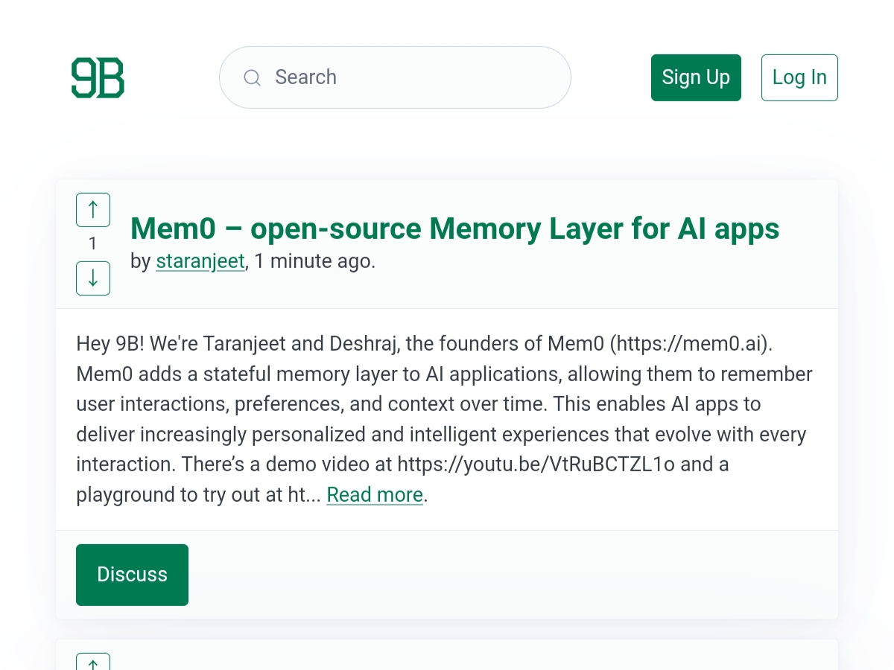

# 9B – A link aggregator/forum you can self-host

9B is a [free] link aggregator/discussion forum service that yocan
self-host easily for any purpose you want (e.g. in-house forum for
your team, public forum for a niche topic, etc).

It is similar to websites you've probably encountered before like [Reddit],
[Lemmy], and [Hacker News], however 9B differs from those that you can:

\- Build it and self-host it yourself in a matter of seconds. \
\- Customize the interface to your liking. \
\- Hack your own version of it.

[free]: https://www.gnu.org/philosophy/free-sw.en.html
[Reddit]: https://old.reddit.com
[Lemmy]: https://join-lemmy.org/
[Hacker News]: https://news.ycombinator.com
